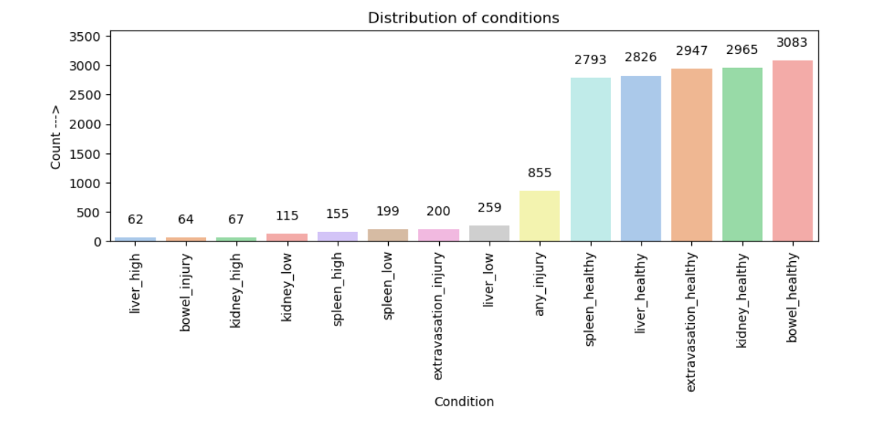
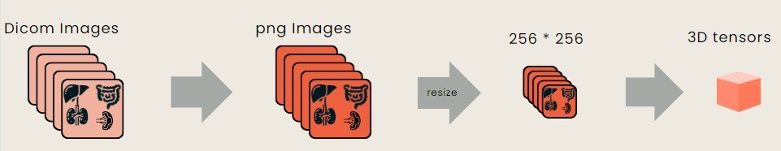

# CNN Model for Abdominal Trauma Detection in CT Scans

  

## Proposal

### 1. Problem Area
The focus is on detecting severe injuries and active internal bleeding in abdominal organs, specifically in cases of blunt force abdominal trauma. This is a critical challenge in emergency medicine, where prompt and accurate diagnosis is essential for effective treatment.

### 2. Users and Benefits
The key stakeholders include:
- Emergency medicine doctors and nurses
- Emergency Department (ED) administrators
- Surgeons
- Radiologists
- Patients experiencing blunt force abdominal trauma, often from motor vehicle accidents

The outcomes of this project aim to enhance their experience by enabling faster and more precise diagnoses, increasing the likelihood of positive recovery outcomes.

### 3. Impact
The potential impact of this project is substantial:
- **Efficient Injury Detection**: Facilitates expedited treatment, which can be life-saving in emergency situations.
- **Cost Reduction in Healthcare**: By minimizing the time spent on diagnosis and treatment planning, it can lead to significant healthcare expense savings and improved quality of life for affected individuals.

### 4. Data Source
- **Dataset**: RSNA Abdominal Trauma Detection Challenge Dataset
- **Description**: A diverse collection of abdominal trauma images with annotations indicating injuries and bleeding, provided by the Radiological Society of North America (RSNA).
- **Reference**: RSNA Abdominal Trauma Detection Challenge

## Data
Data was downloaded from the [RSNA 2023 Abdominal Trauma Detection](https://www.kaggle.com/competitions/rsna-2023-abdominal-trauma-detection/data)

## How to Run
- Ensure you have PyTorch and other necessary libraries installed.
- For installing all necessary libraries, you can use the .yml file `conda env create -f environment.yml`
- Follow the steps outlined in the notebook, starting from data loading to model evaluation.

## EDA

  

## Pre-processing

  

## Overview
This project develops a Convolutional Neural Network (CNN) model using PyTorch, aimed at detecting and classifying traumatic abdominal injuries from CT scans.

## Key Components
1. **Data Loading and Preprocessing**: Implementation of loading and preprocessing steps for the dataset, including normalization and splitting into training and validation sets.

2. **CNN Model Architecture**: A simple 3D CNN model architecture is defined for processing the CT scan images.

3. **Training**: Setup and execution of a training loop for the CNN model.

4. **Evaluation**: Methods to evaluate the model's performance on the validation dataset.

## Technologies Used
- **PyTorch**: For building and training the CNN model.
- **Data Processing Tools**: For handling and preprocessing the CT scan dataset.

## Model Accuracy Results

The CNN model demonstrates high accuracy in classifying different conditions of abdominal organs in CT scans. The results are as follows:

- **Bowel Injury**: 98.57% accuracy
- **Kidney Analysis**:
  - Healthy: 92.86%
  - Low Damage: 94.92%
  - High Damage: 98.10%
- **Liver Analysis**:
  - Healthy: 85.71%
  - Low Damage: 90.79%
  - High Damage: 97.94%
- **Spleen Analysis**:
  - Healthy: 84.76%
  - Low Damage: 92.70%
  - High Damage: 93.81%

These results indicate the model's effectiveness in accurately identifying various states of trauma in abdominal organs.

## Next Steps for Model Improvement

To further enhance the performance and capabilities of the CNN model, the following steps are recommended:

1. **Model Refinement**: 
   - Experiment with different model architectures or tweak the existing model's parameters to improve accuracy, especially in categories where performance is lower.
   - Investigate and implement advanced techniques like data augmentation, regularization, or alternative activation functions to refine the model's learning process.

2. **Implement Transfer Learning**: 
   - Explore the use of transfer learning by utilizing pre-trained models on similar image datasets. This approach can potentially improve the model's performance, especially in complex classification tasks.
   - Consider fine-tuning pre-trained models (such as those available in PyTorch's model zoo) by retraining them on the specific CT scan dataset. This can leverage the learned features from large and diverse datasets, adapting them to the specific nuances of abdominal CT scans.

These steps aim to push the boundaries of the model's accuracy and reliability, potentially leading to more robust and clinically applicable results.

